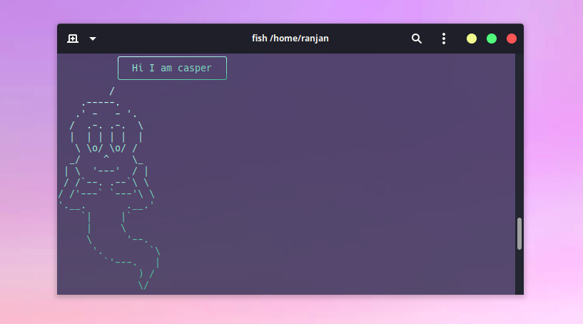
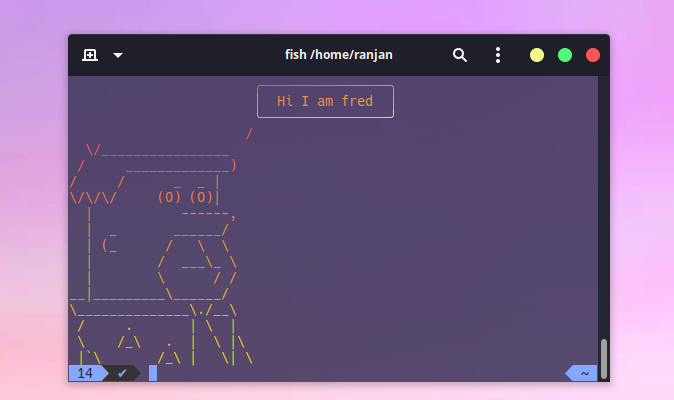
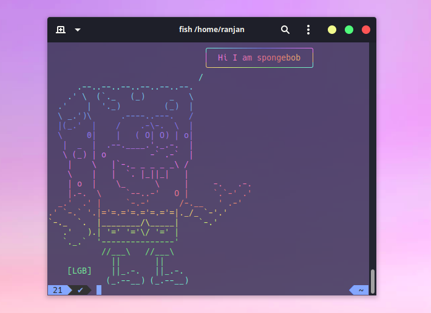
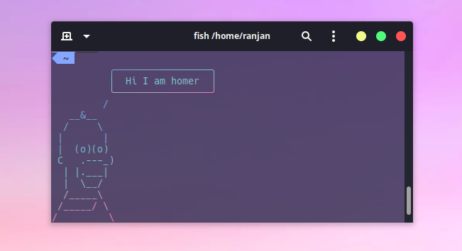

<h1 align="center">ASCII Cartoon Character for terminal 👨‍💻</h3>

<div align="center">


[](http://makeapullrequest.com)

</div>

<br />
<div align="center">
  
  <p align="center">
    You must have heard of cowsay 🐮. But why remain restricted only to cow?
  </p>
    
  <p align="center">
    Here we have collections of famous cartoon and characters that repeats the phrase ready to be used in terminal and your javascript projects.
  </p>
</div>

<!-- ABOUT THE PROJECT -->

## About The Project

This is an ASCII characters collection that you can use on your terminal.

<p align="center"> 
    
    
    
    
</p>

# Usage

## Install globally in your terminal

Make sure you have npm installed in your system

```sh
npm --version
```

Install the package

```sh
npm install -g phraze
```

Check the installation

```sh
phraze --version
```

Finally use it anywhere

- Default cartoon is pup

```sh
phraze "Hello Guys"
phraze "Hello Guys" homer
echo "Hello Guys" | phraze
```

For full command usage see and to view all available characters -

```sh
phraze --help
```

## Import in your javascript project

First install in your local project

```sh
npm install phraze --save
```

Import the package

```js
import { phraze } from "phraze";
```

Use the function

```js
phraze("Your message here!", "pup");
```

Alternatively, you may return a string instead of logging, passing a truthy 3rd argument:

```js
phraze("Your message here!", "pup", true);
```

Function :-

```js
phraze(<type your message here>,<character name here>,<returnMode optional boolean>)
```

## Use in require-based (CommonJS) project

With nodejs >=13 you can consume this module using [dynamic import](https://developer.mozilla.org/en-US/docs/Web/JavaScript/Reference/Statements/import#dynamic_imports) along returnMode

```javascript
const phraze = async (string, character) => {
	return await import("phraze")
		.then((module) => module.phraze(string, (character = "pup"), true))
		.catch((error) => error);
};
```

## Contributors

Want to publish your own ASCII art here for public usage?

Look in `Contributors.md` for full detail. Plus you can add your name signature on your art and take credit for it.

<h3 align="center">Built With</h3>

<p align="center"> 
    
</p>

<h3 align="center">ASCII ART Credits</h3>

<div align="center">

[asciiart](https://www.asciiart.eu/) |
[texteditor](https://texteditor.com/gallery/)

</div>

<h3 align="center">Supported By</h3>
<div align="center">

[boxen](https://github.com/boxen) |
[gradient-string](https://github.com/bokub/gradient-string) |
[taketalk](https://github.com/stephenplusplus/taketalk)

</div>

<div align="center">

  <h3>Our Precious Contributors ❤️</h3>
  <a href="https://github.com/Serjeel-Ranjan-911/ASCII-Art-Cartoon-CLI/graphs/contributors">
  
  </a>
</div>
